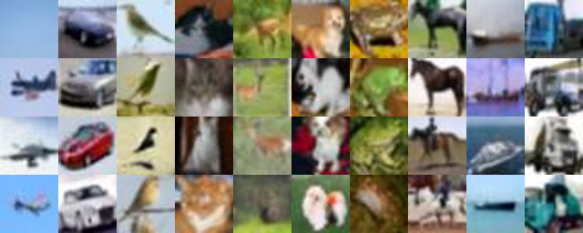
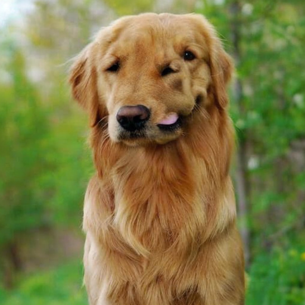
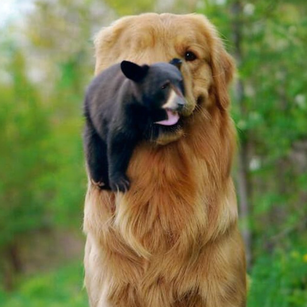

# KNN-project
Project about image generating and inpainting using diffusion models.

## Image generation

Image generation is achieved using Denoising Diffusion model. Unconditional model was trained on Landscape dataset and conditional on CIFAR10 dataset. Solution is based on
[paper](https://arxiv.org/pdf/2006.11239.pdf) and [baseline solution](https://github.com/dome272/Diffusion-Models-pytorch). Improvements to make:
  - [x] More user-friendly to use
  - [x] Add option to change image resolution
  - [x] Add option to continue training from checkpoint
  - [x] Unconditional inpainting
  - [x] Conditional inpainting
  - [x] Implement resampling

### Training
***
Training saves model every epoch as **checkpoint.pt**. It is also possible to save and sample each n-th epoch, results are saved as **sample{epoch}.jpg** and **checkpoint{epoch}.pt**.
All checkpoints are saved in corresponding folders - models and results under name of run.

Training can be launched with following command:

    $ python3 train.py <path to dataset> <epochs> <name of run> 

Possible additional arguments:
- --continue_training <starting epoch\> <checkpoint file\> - From which epoch you want to train (it only looks better) and checkpoint from which you want.
- --image_size <resolution in px\> - Resolution of images for training, must be powers of 2 (32, 64, 128...). **Default is 64**
- --batch_size <images in batch\> - Number of images in batch. For GPUs with more memory bigger batch is better. **Default is 6** (for 10GB and 64x64)
- --save_epoch <n\> - Each n-th epoch it will save checkpoints as mentioned previously. **Default is 25**
- --cuda - Use GPU instead CPU. **Default is CPU**. Only use when CUDA is available!

For training conditional model add following argument:
- --conditional <number of classes\>

### Sampling
***

Unconditional Sampling with following command:

    $ python3 sample.py <path to model> 

Possible additional arguments:
- --images <n\> - number of images to be sampled. **Default is 8**
- --image_size <resolution in px\> - Resolution of images for sampling, can be bigger size that what model was trained on, but results will be undefined. **Default is 64**
- --cuda - Use GPU instead CPU. **Default is CPU**. Only use when CUDA is available!
- --save <name.jpg\> - To save generated images to name.jpg.

Conditional Sampling with following command:

    $ python3 sample_cond.py <path to model> <number of classes>

Possible additional arguments:
- --images <n\> <c\> - number of **n** images to be sampled for class **c**.
- --image_size <resolution in px\> - Resolution of images for sampling, can be bigger size that what model was trained on, but results will be undefined. **Default is 32**
- --cuda - Use GPU instead CPU. **Default is CPU**. Only use when CUDA is available!
- --save <name.jpg\> - To save generated images to name.jpg.

### Results
***
Model for Landscapes was trained with following settings:
- Image size 64x64
- Batch size 6 images

Training run for 750 epochs, on RTX 3080 10GB that took 1:40 minutes per epoch, so around 21 hours.

Model for Cifar10 was trained with following settings:
- Image size 32x32
- Batch size 32 images

Because of the hardware limitations Cifar10 was trained on 32x32 dataset instead of 64x64. Training run for 475 epochs, on RTX 3080 10GB that took 2:20 minutes per epoch, so around 19 hours.

## Inpainting

We implemented inpainting post condition inpainting solution with resampling based on this 
[paper](https://arxiv.org/pdf/2201.09865.pdf).

Inpainting with resampling was implemented on:
- [x] Our Denoising Diffusion model
- [x] [DiT](https://github.com/facebookresearch/DiT)

Inpainting on our model can be run with following command:

    $ python3 sample.py <path to model> --inpainting <path to image> <path to mask>

All other arguments are same as before.

For inpainting on conditional model:

    $ python3 sample_cond.py <path to model> --inpainting <path to image> <path to mask>

All other arguments are same as before.

Mask doesn't have to be the same size as image, but it should have the same aspect ratio for it to work properly.

On DiT, first make sure basic sampling works. Then inpainting can be used with following command:

    $ python3 inpaint.py <path to image> <path to mask> <class to inpaint>

Other arguments are the same as for sampling with DiT.

### Results
***

Inpainting with resampling on Landscapes works perfectly. For removing pier or palm basic inpaint fails terribly, but 10 resample steps makes final image look really convincing.

Inpainting on Cifar datatset works too, but on such small resolution it is pointless. Example instead of pier, inpaint car.

However, on **DiT**, which produces images up to 512x512, it was much clearer to see the difference. **DiT** is trained on ImageNet, so it supports up to 1000 classes.
First example is golden retriever. Mask is applied mainly on his nose.

Setting **DiT** to inpaint class 207 (golden retriever) with no resampling results in this:

With enabled resampling the result is much better. Resample steps are 1, 3 and 4.

If the classes are similliar (retriever and brown bear), model can adapt itself and merge those two. But if the classes are a lot apart (retriever and black bear), model just creates new animal inside dog. And for reversed mask, output is straight terrible.

Because **DiT** works in latent space there is no need for lot of resamoling steps. 3-4 are best.

On the other hand there are examples where basic inpainting is better. Like this hamster:

Clean inpaint, resample with step 1 and resample with step 3:

Or **DiT** inpaint can be used to add new objects.

And replace existing ones.

